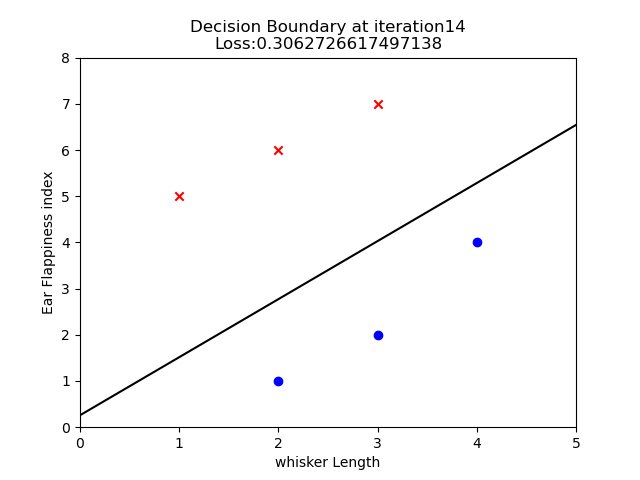

# Logistic Regression
## Overview
This project explores the implementation and behavior of Logistic Regression using Python, NumPy, and Matplotlib.\
The objective was not just to train a classifier, but to understand the mathematical foundations behind Logistic Regression, including:

-Sigmoid Function.\
-Cross-Entropy Loss.\
-Gradient Descent.\
-Matrix-Based Computation.\
-Decision Boundaries

The implementation uses a small two-feature dataset and visualizes how the decision boundary evolves as the model learns.
---
## Prerequisites

Before working on Logistic Regression, I explored the following concepts separately:

- **Sigmoid Function** (`prerequisites/sigmoid.ipynb`)
- **Cross-Entropy Loss** (`prerequisites/cross_entropy_loss.ipynb`)

These notebooks helped build intuition for how Logistic Regression converts linear outputs into probabilities and how model performance is measured during training.

---
## Dataset

A small synthetic dataset with two features was used for visualization purposes.

Features:

-Whisker Length.\
-Ear Flappiness Index

Classes:

-Positive Class.\
-Negative Clas

---

## Project Structure

```text
03-Logistic-Regression
│
├── logistic_regression.ipynb
├── decision-boundary.png
├── README.md
│
└── prerequisites
    ├── sigmoid.ipynb
    ├── cross_entropy_loss.ipynb
    └── loss_plot.png
```


---
## Final Decision Boundary

The image below shows the learned decision boundary after training.



---

## Technologies Used

- Python
- NumPy
- Matplotlib
- Jupyter Notebook

---


## Key Learning

One of the biggest takeaways from this project was realizing how much simpler Machine Learning becomes when you start thinking in terms of **vectors and matrices** rather than individual parameters and summation equations.

Implementing Logistic Regression made it easier to connect several concepts together:

- Linear combinations of features
- Probability estimation using the sigmoid function
- Loss minimization using Cross-Entropy Loss
- Parameter updates using Gradient Descent
- Classification through decision boundaries

---

## Notes

This implementation was created as part of my effort to build a stronger understanding of Machine Learning fundamentals before moving toward larger real-world ML projects.
