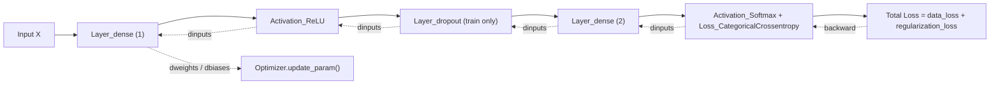

# Neural Networks From Scratch

A step-by-step educational implementation of neural networks using only Python and NumPy.

The project starts with a single hardcoded neuron and gradually builds toward a trainable multi-layer neural network featuring manual backpropagation, optimization algorithms, regularization, and dropout—all implemented from first principles without relying on deep learning frameworks.

This folder is part of the larger [`ML-from-scratch-Series`](../) repository.

<p>


</p>
---

## Why this exists

Deep learning frameworks hide the mechanics of a neural network behind a few lines of `model.fit()`. That's great for building things, but it doesn't build intuition for *why* a network trains, *why* certain optimizers converge faster than others, or *what backpropagation is actually computing* at each layer.

This folder is the result of deliberately avoiding those abstractions — implementing forward passes, gradient computation, and parameter updates by hand, checking the math against NumPy at each step, before ever touching a framework like PyTorch or TensorFlow.

It is a **learning log**, not a production library. Some notebooks are intentionally messy early drafts; later ones are cleaner and better documented, reflecting how the understanding (and habits) improved over the series.

---

## Learning path

The notebooks are meant to be read in order — each one builds on the classes defined in the previous, and several notebooks explicitly reproduce "code so far" before extending it.

| # | Notebook | What it adds | Key idea |
|---|----------|--------------|----------|
| 001 | `single_neuron_py` | A single neuron and a 3-neuron layer, coded with raw Python (no NumPy) | What a neuron actually computes: weighted sum + bias |
| 002 | `layers_of_neurons_numpy` | Same layer, vectorized with `np.dot`; batches of inputs | Why matrix multiplication replaces nested loops |
| 003 | `coding_dense_layer` | `Layer_dense`, `Activation_Relu`, `Activation_Softmax` as classes; first non-linear toy dataset (`spiral_data`) | Formalizing a layer as a reusable object |
| 004 | `cross_entropy_loss_building_blocks` | `Loss` / `Loss_CategoricalCrossentropy`, accuracy metric | How to score how wrong a network's predictions are |
| 005 | `Backprop_SingleNeuron` | Manual gradient descent on one neuron (chain rule, by hand) | Proving backprop works on the smallest possible example |
| 006 | `Backprop_layer` | Same, generalized to a full layer via `np.outer` | Backprop scales from scalar to vector form |
| 007 | `Backprop_matrix` | Full batched matrix backprop; `backward()` added to every class; combined Softmax+CCE gradient | The conceptual core of the series — gradients for a whole batch, one matrix multiply at a time |
| 008 | `test_backprop` | End-to-end forward + backward integration check | Does the full pipeline actually run without errors |
| 009 | `GD_optimizer` | Vanilla SGD → SGD with learning rate decay → SGD with momentum | First real training loop (10,000 epochs) |
| 010 | `Adagrad_optimizer` | Per-parameter adaptive learning rate via squared-gradient cache | Fixes SGD's one-learning-rate-for-everything problem |
| 011 | `RMS_prop` | Adagrad with an exponentially decayed cache | Fixes Adagrad's learning rate collapsing over long runs |
| 012 | `Adam_optimizer` | Momentum + adaptive cache, bias-corrected | Combines 009–011 into the optimizer most frameworks default to |
| 013 | `Regularization` | L1/L2 penalties on weights and biases; first train/validation split | Penalizing large weights to reduce overfitting |
| 014 | `Dropout_layer` | `Layer_dropout` (inverted dropout, train-only) | Randomly zeroing activations as a second regularization strategy |

---

## Architecture

By the final notebooks, a training step follows this shape:

### Forward and Backward Pass



Every class follows the same two-method contract: `forward()` computes and stores its output (and caches anything needed for the backward pass), `backward()` receives the gradient from the next layer and computes its own parameter gradients plus the gradient to pass further back. This mirrors how autograd systems in real frameworks are structured, just without the automatic part.

---

## Math intuition

The following equations summarize the core operations implemented throughout the notebooks.

**Dense layer forward pass**, for input batch `X`, weights `W`, biases `b`:

```
output = X · W + b
```

**Backward pass**, given the incoming gradient `dL/doutput`:

```
dL/dW = Xᵀ · dL/doutput
dL/db = sum(dL/doutput, axis=0)
dL/dX = dL/doutput · Wᵀ
```

**Softmax + Categorical Cross-Entropy**, combined: computing their gradients separately is numerically messier than necessary. When combined, the gradient simplifies to:

```
dL/dinputs = (predicted_probabilities - one_hot_labels) / batch_size
```

This simplification (implemented in `Activation_Softmax_Loss_categoricalCrossentropy.backward`) is why the two are combined into a single class rather than composed generically.

**Optimizer progression** — each addresses a specific limitation of the previous:

| Optimizer | Update rule (simplified) | Problem it solves |
|---|---|---|
| SGD | `w -= lr * dw` | Baseline; single fixed learning rate for all parameters |
| SGD + momentum | `v = momentum*v - lr*dw; w += v` | Dampens oscillation, accelerates consistent-direction updates |
| Adagrad | `cache += dw²; w -= lr*dw / (√cache + ε)` | Per-parameter adaptive rate — large gradients get smaller steps |
| RMSprop | `cache = ρ*cache + (1-ρ)*dw²; w -= lr*dw / (√cache + ε)` | Adagrad's cache only grows, eventually stalling learning; RMSprop decays it |
| Adam | Bias-corrected momentum + bias-corrected RMSprop cache | Combines both benefits above |

---

## Project structure

```
02-Neural_Networks_From_Scratch/
├── src/
│   └── classes.py                              # Consolidated, current implementation of every class
├── 001_single_neuron_py.ipynb
├── 002_layers_of_neurons_numpy.ipynb
├── 003_coding_dense_layer.ipynb
├── 004_cross_entropy_loss_building_blocks.ipynb
├── 005_Backprop_SingleNeuron.ipynb
├── 006_Backprop_layer.ipynb
├── 007_Backprop_matrix.ipynb
├── 008_test_backprop.ipynb
├── 009_GD_optimizer.ipynb
├── 010_Adagrad_optimizer.ipynb
├── 011_RMS_prop.ipynb
├── 012_Adam_optimizer.ipynb
├── 013_Regularization.ipynb
├── 014_Dropout_layer.ipynb
├── .gitignore
└── README.md
```

From notebook `010` onward, notebooks stop redefining classes inline and import the shared implementation instead (`import src.classes as cls`), since by that point the core layer/activation/loss classes were stable.

---

## Usage

```bash
pip install numpy nnfs matplotlib jupyter
```

Training a small 2-layer network on the toy spiral dataset, using the shared `src/classes.py` implementation:

```python
import numpy as np
from nnfs.datasets import spiral_data
import nnfs
import src.classes as cls

nnfs.init()
X, y = spiral_data(samples=100, classes=3)

dense1 = cls.Layer_dense(2, 64, weight_regularizer_l2=5e-4, bias_regularizer_l2=5e-4)
activation1 = cls.Activation_Relu()
dropout1 = cls.Layer_dropout(0.1)
dense2 = cls.Layer_dense(64, 3)
loss_activation = cls.Activation_Softmax_Loss_categoricalCrossentropy()
optimizer = cls.Adam_Optimizer(learning_rate=0.02, decay=5e-7)

for epoch in range(10001):
    dense1.forward(X)
    activation1.forward(dense1.output)
    dropout1.forward(activation1.output)
    dense2.forward(dropout1.output)

    data_loss = loss_activation.forward(dense2.output, y)
    reg_loss = (loss_activation.loss.regularization_loss(dense1) +
                loss_activation.loss.regularization_loss(dense2))
    loss = data_loss + reg_loss

    if epoch % 500 == 0:
        predictions = np.argmax(loss_activation.output, axis=1)
        accuracy = np.mean(predictions == y)
        print(f"epoch {epoch}  loss {loss:.3f}  acc {accuracy:.3f}")

    loss_activation.backward(loss_activation.output, y)
    dense2.backward(loss_activation.dinputs)
    dropout1.backward(dense2.dinputs)
    activation1.backward(dropout1.dinputs)
    dense1.backward(activation1.dinputs)

    optimizer.pre_update_params()
    optimizer.update_param(dense1)
    optimizer.update_param(dense2)
    optimizer.post_update_params()
```

---

## Implementation notes

A few deliberate decisions worth explaining rather than leaving implicit:

- **Optimizers are copy-modified, not inherited.** `Adagrad_optimizer`, `RMSprop_Optimizer`, and `Adam_Optimizer` each duplicate most of `GD_optimizer` rather than subclassing it. This was a conscious tradeoff for this series: duplication makes it possible to read any single optimizer top-to-bottom and see exactly what's different, at the cost of repeated code. A shared base class with overridden update rules would be the better structure for a production library.
- **Regularization lives inside `Layer_dense`**, not as a separate wrapper — the L1/L2 penalty terms are added directly in `backward()`, and `Loss.regularization_loss()` sums the penalty across all regularized layers. This mirrors how the loss and gradient computation are conceptually coupled.
- **Dropout is correctly excluded from validation/inference.** The validation forward pass in notebooks 013–014 skips the dropout layer entirely, which is the correct behavior — dropout is a training-time-only regularizer.
- **A real bug was caught and fixed during this series**: the validation-accuracy calculation in notebooks 013 and 014 was originally nested inside a conditional that only ran for one-hot-encoded labels, so it silently reported stale training accuracy instead of true validation accuracy for the sparse-label case actually used. Fixed by moving the accuracy calculation outside the conditional.

---

## Known limitations

Being upfront about what this is *not*:

- Only tested on `nnfs`'s synthetic spiral dataset — never run against a real-world dataset (e.g. MNIST).
- Network depth is wired manually per notebook (two `Layer_dense` instances chained by hand) rather than through a general `Sequential`-style container.
- No automated test suite — correctness was checked by comparing intermediate outputs against expected values printed in each notebook, not via `pytest`.
- Early notebooks (001–002) predate the class-based design and are kept as-is for the learning progression, not as representative code style.

---

## Roadmap

- [ ] Add a lightweight test suite for `src/classes.py`
- [ ] Generalize to an arbitrary-depth `Sequential`-style container instead of manually chained layers
- [ ] Evaluate on a real dataset beyond the synthetic spiral data
- [ ] Refactor optimizers to share a base class (addressing the duplication noted above)

---

## Contributing

This is primarily a personal learning project, so it isn't structured for external contributions in the traditional sense. That said, if you spot a bug or a mathematical error, an issue or pull request is welcome.

---

## Who is this repository for?

This repository is intended for:

- Students learning deep learning from first principles
- Developers who want to understand what frameworks like PyTorch and TensorFlow automate
- Anyone interested in the mathematics behind forward propagation, backpropagation, and optimization
- Recruiters or engineers looking for an educational implementation of neural networks in pure NumPy
---

## License

Released under the [MIT License](../LICENSE) — free to use, modify, and share.

---

## Acknowledgements

The class structure, dataset (`nnfs`'s `spiral_data`), and overall learning progression in this folder closely follow **Harrison Kinsley and Daniel Kukieła's *Neural Networks from Scratch in Python*** (NNFS). That book/course was the primary reference used while working through this series, and credit belongs to its authors for the pedagogical structure being followed here.
Special thanks to Harrison Kinsley (Sentdex) and Daniel Kukieła for creating the excellent Neural Networks from Scratch book and course, which served as the primary educational reference for this project.
