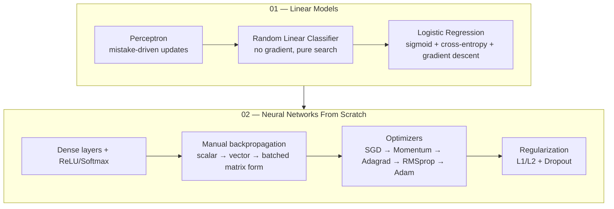

# ML-from-scratch-Series

A collection of machine learning and deep learning algorithms implemented from scratch, using only Python and NumPy, to build a working understanding of the mathematics behind them before relying on any framework.

<p>


</p>

---

## Why this exists

Most ML/DL learning resources move quickly to `model.fit()`. That's the right call for building things, but it skips past the part where you actually understand what's happening: why a perceptron converges, what a gradient is computing, why Adam trains faster than plain SGD.

This repository is the opposite approach — every algorithm here is implemented from first principles, checked against expected outputs by hand, before ever reaching for a library that would do it automatically. Each folder is a self-contained learning unit with its own notebooks and its own README.

This is a **learning log**, not a production ML library. Code quality, documentation depth, and rigor improve as the series progresses — earlier folders are rougher than later ones, and that's left visible rather than cleaned up retroactively.

---

## Series overview



The throughline across the whole series: each folder increases in mathematical and implementation sophistication, and later folders explicitly build on habits (documentation, testing forward/backward passes, honest validation) established in earlier ones.

| Folder | Focus | Status |
|---|---|---|
| [`01-Linear-Models`](./01-Linear-Models) | Perceptron, Random Linear Classifier, Logistic Regression | Complete |
| [`02-Neural_Networks_From_Scratch`](./02-Neural_Networks_From_Scratch) | Dense layers, backpropagation, optimizers, regularization, dropout | Complete |

---

## Repository structure

```
ML-from-scratch-Series/
├── 01-Linear-Models/
│   ├── 01-Perceptron/
│   │   ├── perceptron.ipynb                 # Mistake-driven perceptron algorithm + decision boundary visualization
│   │   ├── Convergence_theorem.ipynb         # Empirical verification of the perceptron mistake bound (R/γ)²
│   │   └── Decision_Boundary_over_iterations.png
│   ├── 02-Random-Linear-Classifier/
│   │   ├── train_full_data.ipynb             # Baseline: random hyperplane search on the full dataset
│   │   ├── train_test_split.ipynb            # Train/test split + k-fold CV to select best hyperparameter k
│   │   ├── results.png/
│   │   └── README.md
│   ├── 03-Logistic-Regression/
│   │   ├── prerequisites/
│   │   │   ├── sigmoid.ipynb                 # Intuition: how θ, θ0 shape the sigmoid curve
│   │   │   └── cross_entropy_loss.ipynb      # Intuition: how cross-entropy penalizes wrong predictions
│   │   ├── logistic_regression.ipynb         # Full gradient descent training loop
│   │   ├── decision-Boundary.png
│   │   └── README.md
│   └── README.md
│
├── 02-Neural_Networks_From_Scratch/
│   ├── src/
│   │   └── classes.py                        # Consolidated Layer/Activation/Loss/Optimizer implementation
│   ├── 001_single_neuron_py.ipynb ... 014_Dropout_layer.ipynb
│   └── README.md
│
└── README.md                                  # you are here
```

Each numbered folder has its own README with a full breakdown of its notebooks, the math involved, and implementation notes specific to that folder — this file is deliberately kept high-level.

---

## What's covered

**`01-Linear-Models`** — three approaches to binary linear classification, in increasing sophistication:
- **Perceptron**: the classical mistake-driven algorithm, plus an empirical check of the perceptron convergence theorem's mistake bound
- **Random Linear Classifier**: a deliberately naive baseline — no gradient at all, just random search over separating hyperplanes — extended with a proper train/test split and k-fold cross-validation to select the search budget
- **Logistic Regression**: sigmoid activation, cross-entropy loss, and batch gradient descent, built up from two prerequisite notebooks that isolate the sigmoid and the loss function before combining them into a trainable model

**`02-Neural_Networks_From_Scratch`** — a small neural network library built one concept at a time: a single neuron → vectorized layers → a `Layer_dense` class → activation functions (ReLU, Softmax) → categorical cross-entropy loss → manual backpropagation (scalar, then per-layer, then full batched matrix form) → a progression of optimizers (SGD → momentum → Adagrad → RMSprop → Adam) → L1/L2 regularization → dropout. Full details, math, and architecture diagrams are in that folder's own README.

---

## Getting started

```bash
git clone https://github.com/abhishekyadav-ai/ML-from-scratch-Series.git
cd ML-from-scratch-Series

pip install numpy matplotlib scikit-learn nnfs jupyter
jupyter notebook
```

- `01-Linear-Models` notebooks depend on `numpy`, `matplotlib`, and `scikit-learn` (for `train_test_split` / `KFold` in the Random Linear Classifier folder only).
- `02-Neural_Networks_From_Scratch` notebooks additionally depend on `nnfs` (used for its `spiral_data` toy dataset and consistent random seeding).

---

## Contributing

This is primarily a personal learning project. That said, if you spot a bug, a mathematical error, or have a suggestion, feel free to open an issue or pull request.

---

## Acknowledgements

- The **Linear Models** section (Perceptron, convergence theorem, notation for `θ`, `θ0`, margin, and mistake bounds) follows the framing used in **MIT's 6.036 — Introduction to Machine Learning** (OpenCourseWare).
- The **Neural Networks From Scratch** section follows the implementation structure and pedagogical progression of **Harrison Kinsley and Daniel Kukieła's *Neural Networks from Scratch in Python*** (NNFS), including use of the `nnfs` package and its `spiral_data` toy dataset.

Both were used as the primary learning references for their respective sections; credit belongs to their original authors for the structure being followed here.
